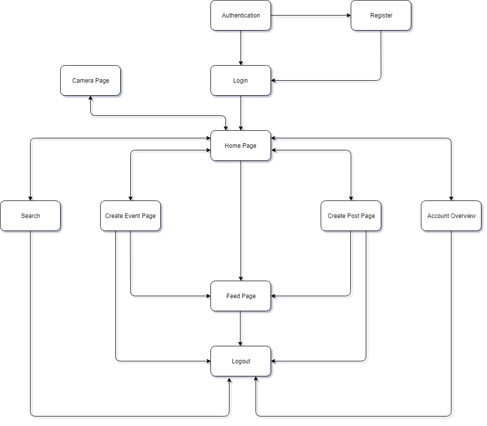

# Report

## Introduction

The Report outlines the structure and the design process undertaken while developing the Progressive Web Application(PWA). The purpose of this app is to build an app that can record and share information with other people at music events. These include pictures, videos, and their descriptions as well as other information that will make it easier for the people at the event or festival to their experience with whomever they wish.

## Diagram

## Tasks

### 1. Interface to insert and search data via forms

#### Challenges

The biggest challenge faced by us was to design and implement a consistent UI, that would be suitable for both mobile and desktop users. Being a PWA, the web application did support desktop functionality well but had issues displaying forms on mobile devices and interacting with them was difficult.

#### Solution

The solution that was implemented for searching events through forms was first designed as a popup but later changed to a separate page as we realized that it wasn't consistent with the user interface of the app and the flow between the main page and the popup wasn't as smooth. Furthermore, the popup looked cluttered on mobile devices. Therefore, a separate page was implement for searching the data through forms. This greatly enhanced the user experience and ensured a clear and understandable flow.

#### Requirements

The project meets the requirements as given in the task description i.e. The searching and the querying is done by using the three parameters as pointed out. These are the name, location and the dates of the events. Furthermore, When creating or adding to stories, the required information is requested and used for validation to prevent submission. The search is only completed when enough information is present.

#### Limitation

The limitation that is obvious in our implementation is that it lacks the functionality at this stage to function as we would have liked it to. The function related to search parameters providing a complete and successful search lacks certain parts that are crucial.

### 2. Interface to search data via map

#### Challenges

Each event should contain the address of the venue. But the address is not directly searchable, we need the gps coordinates to pinpoint the exact location on the map.

#### Solution

We use Leaflet APIs to solve each of the following problems:

  - Geocoding API - converting addresses (like a street address) into geographic coordinates (like latitude and longitude)
  - Maps JavaScript API - drawing the maps from the obtained coordinates

Leaflet is a JavaScript library that helps build interactive maps. We use this library to display all the maps on the project website and using the APIs and the features of Leaflet we are able to mark specific areas and locations using pins and hence, are able to implement the search feature that makes of these pins to return a location to the user.

#### Requirements

The assignment requires that the interface allow users to search for events and stories given. This includes the name, location (which makes use of pins on the map) and the dates of the events. The solution provided tries to implement this in the best possible way, and does as much of it as possible.

#### Limitation

Our implementation  works as required.

### 3. PWA - caching of the app template using a web worker

#### Challenges

The challenge we faced was to ensure that the app was functional with limited network connections and choose the best possible caching strategy.

#### Solution

We have implemented service workers that use static and dynamic caching solutions. Static caching only stores the app template whereas dynamic caching stores dynamic contents such as icons and fonts used from external web sources.

#### Requirements

To make the app work offline, caching of the app is required. The static template and dynamic contents need to be cached in order to be user-friendly. This has been implemented in the project using indexDB and when the user views pages of the application they are stored and can easily be reloaded from the browser cache.

#### Limitation

The cached versions of the application might be outdated when using the application offline.

### 4. PWA: caching data using IndexedDB

#### Challenges

The main challenge was to make the right requests for obtaining the MongoDB data in the cached IndexDB copy.

#### Solution

As we load the main page, we cache the data from MongoDB into two IndexDB indexes, one for festivals and the other for posts.

#### Requirements

Provide offline experience, load content fast, be user friendly.

#### Limitation

Our solution does not use sync feature of service worker for IndexedDB.

### 5. NodeJS server including non-blocking organization of multiple dedicated servers

#### Challenges

Since NodeJs is a single-threaded, the app needs to not have non-blocking code with asynchronous javascript code.

#### Solution

Currently, we are using Promises where possible.

#### Requirements

Main thread needs to not to do heavy computations. And the app must not be giving unexpected results due to the asynchronous nature of javascript.

#### Limitation

Currently, our implementation uses a single server to serve the app but it can easily be scaled up to use multiple servers without any issues.

### 6. MongoDB

#### Challenges

Finding which object stores are needed and leverage how data is queried and added (ajax or socket.io, controller functions). Associating data with users.

#### Solution

Our solution is comprised 4 stores - festivals, posts, genres and users. We initialize the database at the app start and require user to login with preexisting account or create a new one. The demo account is email: admin@admin.com, pass: admin.

#### Requirements

The server should be backed by MongoDB.

#### Limitation

The MongoDB implementation works as required.

### 7. Quality of Web solution

#### Challenges

The development process led to many challenges including a steep learning curve for all the new technologies such as ajax, the correct handling of the json data and fixing multiple bugs along the initial implementation.

#### Solution

To overcome this issues we employed peer review so that each member can contribute to the goal for completeness in our understanding.

#### Requirements

#### Limitation

## Conclusions

Implementing complex client/server architectures introduced us to a wide range of new and emerging technologies. By doing this assignment we have learned how to exchange data between servers using JSON, Ajax and socket.io, implementing scalable servers using Node.js, and building user-friendly offline Progressive Web Applications.

## Division of Work

Malvin Todorov - MongoDB, map, models, controller, IndexDB, ui and some other pages
Tumurtogtokh Davaakhuu - cache, IndexDB, service worker, camera and some other pages.
Huzaifa Ahmed - Documentation, Front-end, Forms, Report, Flow Chart, User Interaction and other pages.

A short note that we got an extension for this project due to issues 2 members.

## Extra Information

- To run the application:

  1. Execute `npm start` in the `/solution` folder
  2. Execute `npm run sass` if sass needs to be compiled to css
  3. Ensure that the MongoDB port is the same as the one specified (Default port: ​27017)
  4. The Application runs on https://localhost:3000

- Cookies are used to identify session for a user. Make sure cookies are not cleared

## Bibliography
